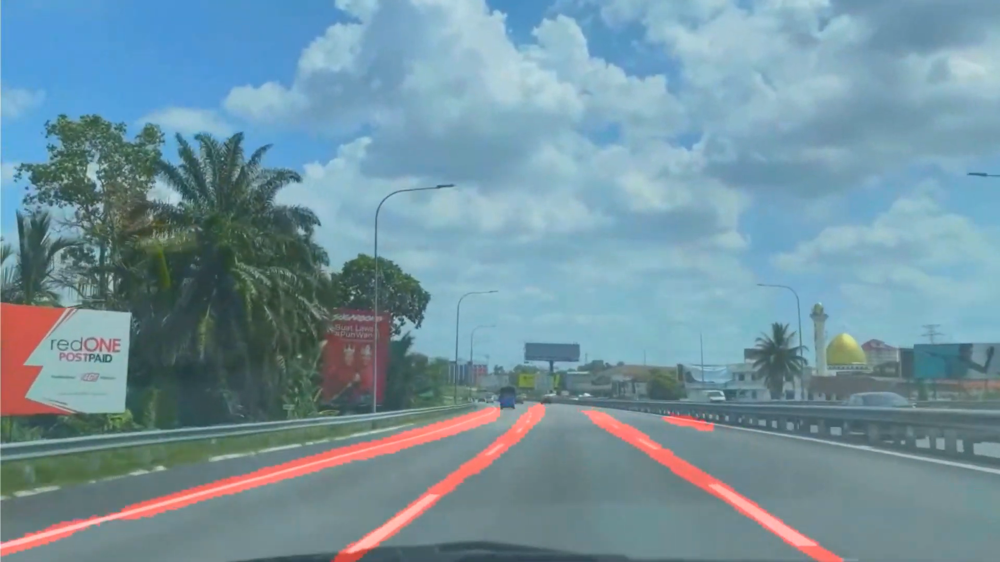

# Lane-Markings-Detection


## Lane Markings Detection using UNet
To create a [UNet](https://arxiv.org/abs/1505.04597v1) Architecture using TensorFlow Keras to detect lane markings on the road. The model was trained on [CULane Dataset](https://xingangpan.github.io/projects/CULane.html).

Demonstration of end results: https://www.youtube.com/watch?v=e2sPcV0vBSs

### Running
1. Create a virtual environment and install the requirements:

    ```pip install -r requirements.txt```
2. Download the data from [CULane Dataset](https://xingangpan.github.io/projects/CULane.html) and extract in the ./data folder.

3. Change the configuration in config.yaml (if needed). Set ```full_training``` to ```True``` if train on all of the training data, else set as ```False``` to train only on ```driver_161_90frame```.

4. Run main.py. Model weights and train history will be stored in ./model folder.


### Note

I did this project few years ago and this was my first deep learning project when I just started learning in this field. Now I look back to my code and think that the code is a mess :sweat_smile:.

I decided to rewrite the code so that it look nicer to read. I just rewrite the code, but did not improve on the work (adding data augmentation, optimization, etc)

There are a lot of improvements can be done, feel free to explore.

If you are interested, you can go to the archive folder and look at the messy code when I just started learning.


